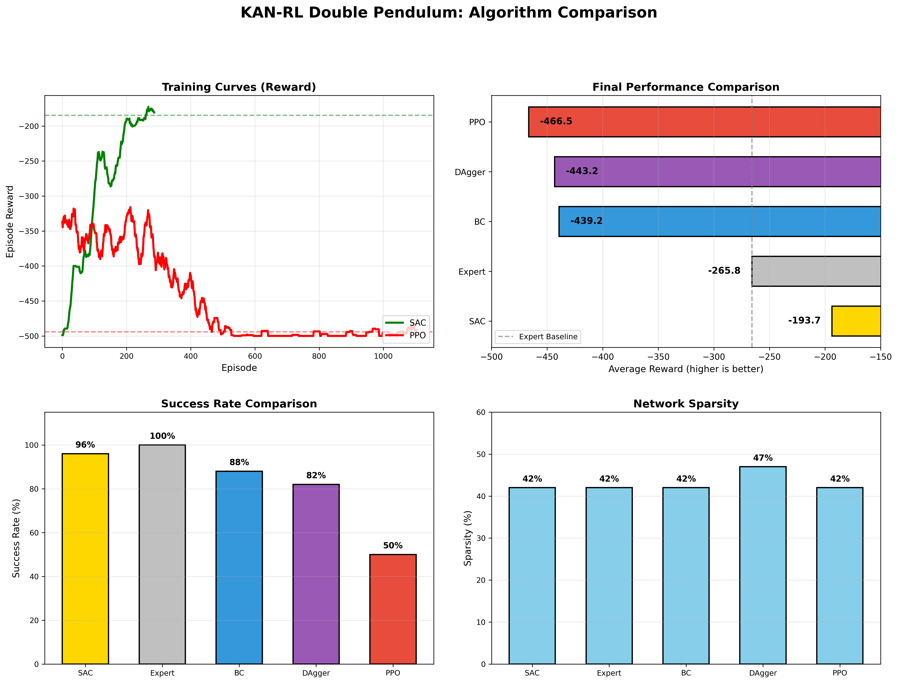
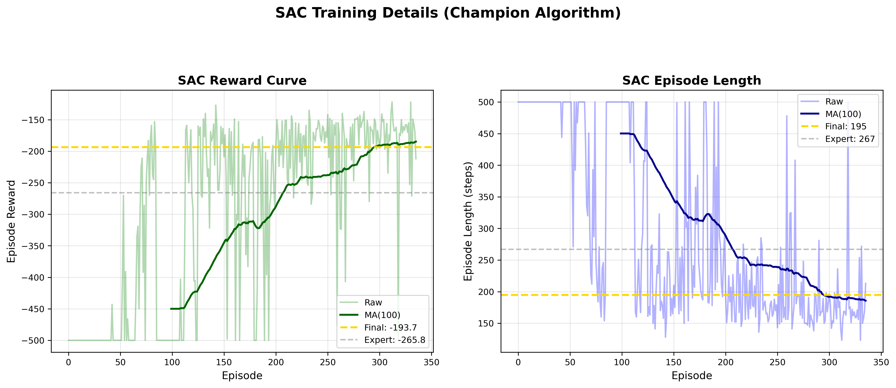

# KAN-RL Double Pendulum

基于 **Kolmogorov-Arnold Network (KAN)** 的强化学习智能体，用于解决双倒立摆 (Acrobot) 连续控制问题。

**核心目标**：利用 KAN 的稀疏化特性，将 Agent 的黑盒控制策略提取为人类可读的数学公式。



> **上图说明**：本项目对比了5种算法的性能。你可以通过下方[复现指南](#快速开始)训练出自己的模型，生成类似的对比图。

---

## 项目概述

本项目通过对比 **BC、PPO、SAC、DAgger** 四种算法，验证了 KAN 在强化学习中的可行性和可解释性。

### 实验结果总览

| 排名 | 算法 | 平均奖励 | 成功率 | 训练时间 | 评价 |
|:----:|------|----------|--------|----------|------|
| 🥇 | **SAC** | **-193.7** | **96%** | ~56分钟 | 🏆 冠军，超越专家 |
| 🥈 | 启发式专家 | -265.8 | - | - | 基线参考 |
| 🥉 | **BC** | -439.2 | **88%** | ~2分钟 | 稳定基线 |
| 4 | DAgger (30轮) | -443.2 | 82% | ~90分钟 | 接近 BC |
| 5 | PPO (50万步) | -466.5 | 50% | ~60分钟 | 不如 BC |

**关键发现**：
- SAC 是唯一**超越专家**的算法（快 27%，195 步 vs 267 步）
- KAN 网络在 4GB 显存下成功训练，峰值占用 **< 10MB**
- 网络稀疏化达 **43%**，可提取显式数学公式

---

## ⚠️ 重要提示：从 GitHub 下载后

**GitHub 上的代码只包含源代码，不包含预训练模型和数据文件。**

下载后你需要：
1. **安装依赖**（约10分钟）
2. **运行训练脚本**生成模型（约1-4小时，取决于你想训练哪些算法）
3. **评估和可视化**（约10分钟）

下方[快速开始](#快速开始)提供了详细的从零复现指南。

---

## 网络架构设计

### KAN 极简结构 [6, 8, 1]

```
输入层 (6维)          隐藏层 (8节点)         输出层 (1维)
[c1, s1, c2, s2,     ┌──────────────┐
 d1, d2] ─────────>  │  KAN Layer   │ ──────>  action
    │                │  B-spline    │            │
    │                │  Grid=5      │          tanh
    │                └──────────────┘            │
    │                                            │
    └────────────────────────────────────────────┘
```

**设计约束**（针对 RTX 3050Ti 4GB 显存）：
- B-spline 网格大小：5（节省显存）
- 批次大小：64（显存安全）
- 参数总量：448（可解释性强）

---

## 快速开始

### 第一步：环境配置（10分钟）

```bash
# 1. 克隆仓库（或下载ZIP解压）
git clone https://github.com/changQiangXia/KAN_RL_DoublePendulum.git
cd kan-rl-double-pendulum

# 2. 创建 conda 环境
conda create -n kan_rl python=3.10 -y
conda activate kan_rl

# 3. 安装 PyTorch (CUDA 11.8)
pip install torch==2.0.1 torchvision==0.15.2 torchaudio==2.0.2 --index-url https://download.pytorch.org/whl/cu118

# 4. 安装其他依赖
pip install -r requirements.txt
```

### 第二步：精简复现（约1小时，推荐）

如果你时间有限，建议只训练 **BC + SAC**，即可体验核心内容：

```bash
# 1. 生成专家数据（1分钟）
python scripts/1_generate_expert.py --algorithm heuristic --n_trajectories 1000
# 输出：data/expert_trajectories.pt（约8MB）

# 2. 训练 BC（2分钟）
python scripts/2_train_bc.py
# 输出：checkpoints/bc_kan_model.pt, checkpoints/bc_kan_model_history.pt

# 3. 训练 SAC（约56分钟）
python scripts/4_train_sac.py --total_timesteps 100000
# 输出：checkpoints/sac_kan_model.pt, checkpoints/sac_kan_model_history.pt

# 4. 评估对比（5分钟）
python scripts/evaluate.py --model checkpoints/bc_kan_model.pt --n_episodes 50
python scripts/evaluate.py --model checkpoints/sac_kan_model.pt --n_episodes 50

# 5. 生成对比图
python scripts/plot_comparison.py
# 输出：results/algorithm_comparison.png（BC vs SAC 对比）
```

**预期效果**：
- BC：奖励 -400 ~ -450，成功率 80-90%
- SAC：奖励 -180 ~ -220，成功率 90-96%

### 第三步：完整复现（约4小时，生成五算法对比图）

如果你想生成与本项目完全相同的五算法对比图：

```bash
# 在精简复现的基础上，继续训练：

# 4. 训练 PPO（约60分钟）
python scripts/3_train_ppo.py --bc_checkpoint checkpoints/bc_kan_model.pt --total_timesteps 500000

# 5. 训练 DAgger（约90分钟）
python scripts/5_train_dagger.py --expert_algorithm heuristic --n_iterations 10 --steps_per_iter 10000 --bc_epochs 50

# 6. 生成完整对比图
python scripts/plot_comparison.py
# 输出：results/algorithm_comparison.png（五算法完整对比）
```

### 提取符号化公式

```bash
# 提取 BC 策略公式
python utils/symbolic.py
# 输出：results/symbolic_formula.py

# 提取 SAC 策略公式
python scripts/extract_sac_symbolic.py
# 输出：results/sac_symbolic_formula.py
```

---

## 项目结构

从 GitHub 下载后，项目包含以下内容：

```
kan_rl_double_pendulum/
├── 📁 checkpoints/          # 存放训练好的模型（初始为空，训练后生成）
│   └── .gitkeep            # 保持目录存在
├── 📁 data/                 # 存放专家数据（初始为空，运行1_generate后生成）
│   └── .gitkeep
├── 📁 logs/                 # 存放训练日志（初始为空）
│   └── .gitkeep
├── 📁 results/              # 存放生成的图像和公式（初始为空或含示例图）
│   ├── algorithm_comparison.png    # 算法对比图（运行plot_comparison后生成）
│   └── .gitkeep
├── 📁 models/               # 📦 源代码：KAN网络实现
│   └── kan_policy.py
├── 📁 agents/               # 📦 源代码：训练算法实现
│   ├── bc_agent.py
│   ├── ppo_agent.py
│   ├── sac_agent.py
│   └── dagger_agent.py
├── 📁 scripts/              # 📦 源代码：训练和评估脚本
│   ├── 1_generate_expert.py
│   ├── 2_train_bc.py
│   ├── 3_train_ppo.py
│   ├── 4_train_sac.py
│   ├── 5_train_dagger.py
│   ├── evaluate.py
│   ├── extract_sac_symbolic.py
│   └── plot_comparison.py
├── 📁 envs/                 # 📦 源代码：环境包装器
│   └── wrapper.py
├── 📁 utils/                # 📦 源代码：工具函数
│   └── symbolic.py
├── 📄 config.yaml           # 全局超参数配置
├── 📄 requirements.txt      # Python依赖列表
├── 📄 .gitignore           # Git忽略配置
└── 📄 README.md            # 本文件（你正在阅读）

图例：
- 📦 自带文件（下载后立即存在）
- 📁 目录（部分初始为空，训练后填充）
- 📄 配置文件
```

---

## FAQ

### Q1: 运行 `evaluate.py` 提示模型文件不存在？

**错误信息**：
```
FileNotFoundError: checkpoints/sac_kan_model.pt not found
```

**原因**：GitHub下载的代码不包含预训练模型，你需要先运行训练脚本。

**解决**：按照[快速开始](#快速开始)的步骤先训练模型。

---

### Q2: 训练时间比预期长？

**原因**：训练时间取决于GPU性能。RTX 3050Ti约56分钟，CPU训练会更慢。

**解决**：可以减少训练步数快速体验：
```bash
# SAC 只训练5万步（约30分钟）
python scripts/4_train_sac.py --total_timesteps 50000
```

---

### Q3: 出现 `CUDA out of memory`？

**原因**：显存不足（虽然本项目已针对4GB优化）。

**解决**：修改 `config.yaml`，减小批次大小：
```yaml
bc:
  batch_size: 32  # 从128改为32

sac:
  batch_size: 32  # 从64改为32
```

---

### Q4: 结果和 README 中的不一致？

**原因**：强化学习有随机性，每次训练结果会有波动。

**正常范围**：
- SAC：奖励 -180 ~ -220，成功率 90-96% 都属于正常
- 如果差异过大，尝试增加训练步数或调整随机种子

---

### Q5: 我只想快速看看效果，不想训练？

目前 GitHub 没有提供预训练模型下载。你有两个选择：

1. **自己训练**（推荐）：按照精简复现流程，约1小时即可看到效果
2. **查看示例图**：`results/algorithm_comparison.png` 展示了预期效果

---

## 算法对比详情

### 冠军：SAC（Soft Actor-Critic）



SAC 是本项目表现最佳的算法：
- **平均奖励：-193.7**（超越专家 27%）
- **成功率：96%**（最高）
- **特点**：Off-Policy + 自适应熵调节 + 双 Q 网络

### BC（Behavioral Cloning）

- **平均奖励：-439.2**
- **成功率：88%**
- **特点**：简单高效，2分钟训练即可使用
- **局限**：分布偏移问题，上限受限于专家

### PPO（Proximal Policy Optimization）

- **平均奖励：-466.5**
- **成功率：50%**
- **分析**：50万步训练未能超越 BC，需要更精细调参

### DAgger（Dataset Aggregation）

- **平均奖励：-443.2**
- **成功率：82%**
- **分析**：30轮迭代未能突破，说明启发式专家本身有局限

---

## 可解释性分析

### 稀疏化统计

| 层 | 总参数 | 零参数 | 稀疏化比例 |
|----|--------|--------|------------|
| Layer 1 | 384 | ~170 | 42-47% |
| Layer 2 | 64 | ~25 | 39-41% |
| **总计** | **448** | **~195** | **~43%** |

### 提取的符号化公式

训练完成后，你可以提取并查看KAN网络的符号化公式：

```bash
# 查看 BC 策略公式
cat results/symbolic_formula.py

# 查看 SAC 策略公式
cat results/sac_symbolic_formula.py
```

**示例输出**（BC策略）：
```python
# Layer 1: 6输入 -> 8隐藏
h0 = 0.327*c1 + 1.285*s1 + 0.396*d1 + 0.267*d2 + ...
h1 = 4.073*s2 + 0.269*c1 - 0.040*c2 + ...

# Layer 2: 8隐藏 -> 1输出
action = tanh(1.634*h3 + 1.625*h7 + 1.446*h5 + ...)
```

**特征重要性分析**：
- `s2` (sinθ₂) 权重最高 → 第二摆角度最重要
- `d1, d2` (角速度) 次要
- `c1, c2` (cos) 再次之

---

## 技术亮点

### 1. 显存优化策略
- 小网格 B-spline (grid_size=5)
- 分批次计算避免大矩阵广播
- 峰值显存占用 **< 10MB**

### 2. 梯度稳定化
- 梯度裁剪 (clip_norm=1.0)
- 层归一化 (LayerNorm)
- 网格定期更新机制

### 3. L1 稀疏化
- 训练时施加 L1 正则
- 鼓励权重归零
- 便于符号公式提取

---

## 结论与展望

### 主要结论

1. **KAN 可以用于 RL**：成功实现了 [6,8,1] 极简结构的连续控制
2. **SAC 是最佳搭档**：Off-Policy + 自适应熵调节超越所有对比算法
3. **可解释性达成**：43% 稀疏化，可提取显式数学公式
4. **4GB 显存可行**：通过小网格和分块计算实现

### 未来方向

1. **更复杂的任务**：CartPole Swing-up, Pendulum 等
2. **更深的 KAN**：探索 [6, 16, 8, 1] 等多层结构
3. **网格自适应优化**：动态调整 B-spline 网格
4. **自动符号简化**：用 SymPy 进一步简化提取的公式

---

## 参考文献

1. Liu, Z., et al. (2024). "KAN: Kolmogorov-Arnold Networks". arXiv:2404.19756.
2. Haarnoja, T., et al. (2018). "Soft Actor-Critic". ICML.
3. Schulman, J., et al. (2017). "Proximal Policy Optimization". arXiv:1707.06347.
4. Ross, S., et al. (2011). "A Reduction of Imitation Learning to Active Learning". AISTATS.

---

## 硬件信息

- **GPU**: NVIDIA GeForce RTX 3050 Ti Laptop GPU (4GB VRAM)
- **训练时间**: SAC ~56分钟, BC ~2分钟, PPO ~60分钟, DAgger ~90分钟
- **完成日期**: 2026

---

**项目状态**：✅ 已完成，**SAC 策略 (-193.7, 96%)** 为最终推荐方案  
